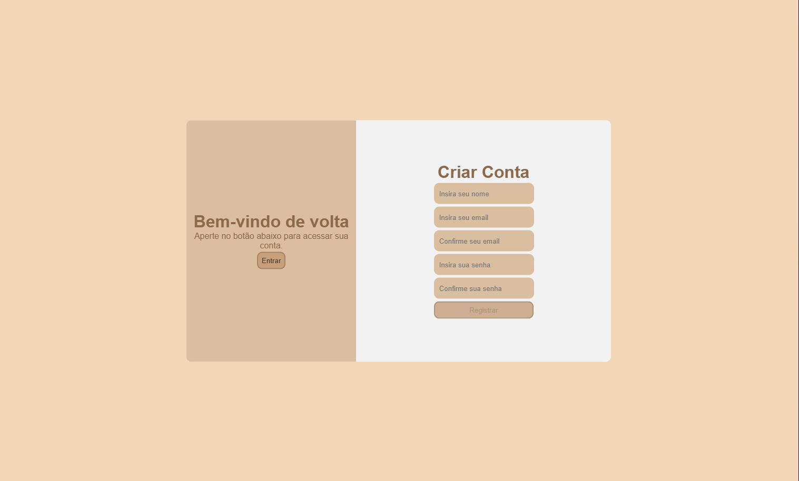
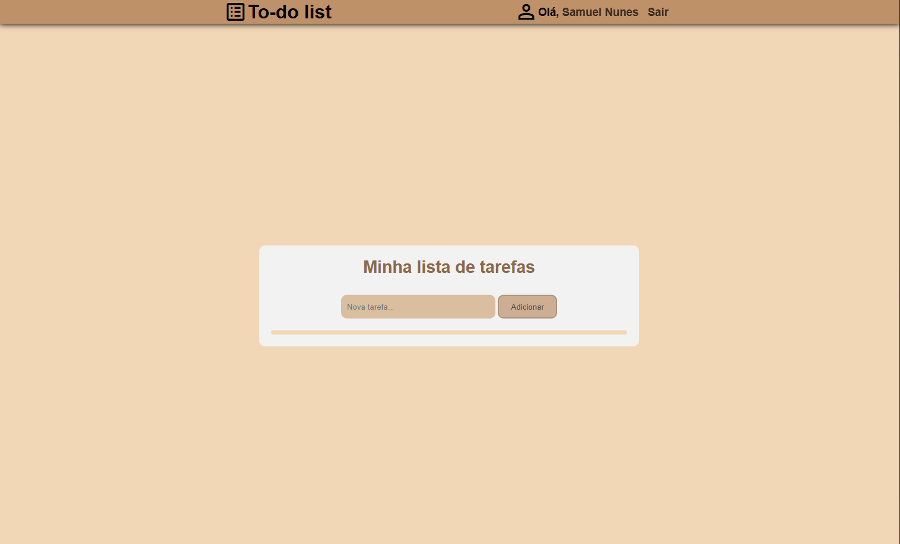
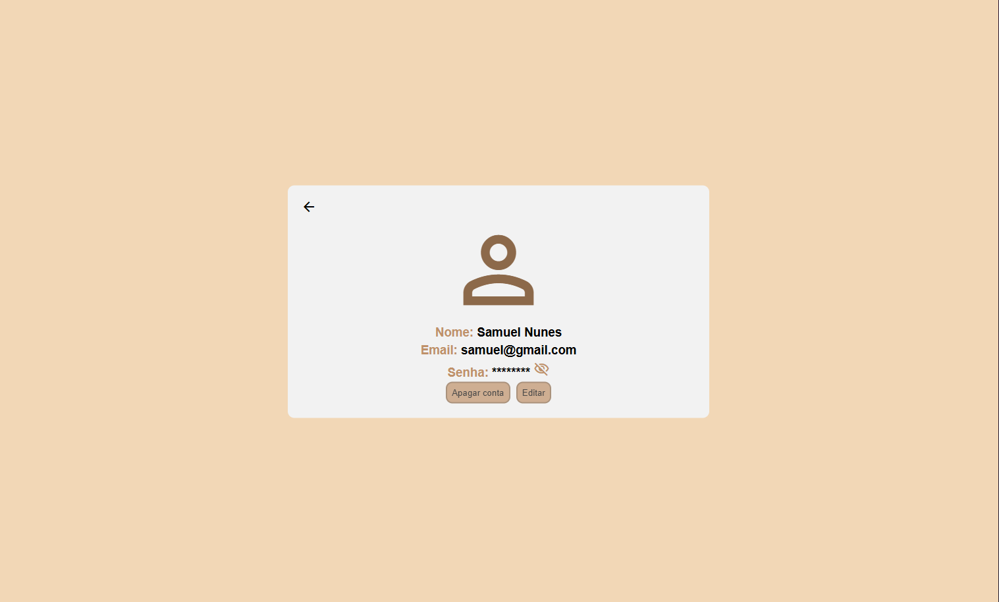

# To-do List com sistema de autenticação

Um sistema de To-do List com sistema de contas. A aplicação utiliza PHP para o backend, MySQL como banco de dados, e HTML, CSS e Javascript para o frontend.

---

---

## 🛠 Tecnologias Utilizadas

- **Frontend**: HTML, CSS, Javascript
- **Backend**: PHP
- **Banco de Dados**: MySQL

---

## 📋 Pré-requisitos

1. Servidor local (exemplo: [XAMPP](https://www.apachefriends.org/) ou [WAMP](https://www.wampserver.com/)).
2. PHP versão 7.4 ou superior.
3. MySQL configurado no servidor local.

---

# 📝 Licença
Este projeto é distribuido sob a licença MIT. Consulte o arquivo **LICENSE** para mais informações.

---

# 📬 Contato
Se você tiver dúvidas ou sugestões, entre em contato:
- Nome: Samuel Nunes
- Email: samuel.n.c.nun3s@gmail.com
- GitHub: <a href="https://github.com/Samuel-Nun3s">Samuel-Nun3s</a>
